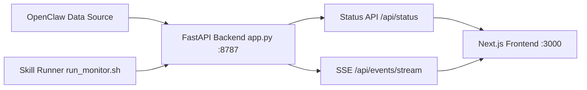

# OpenClaw Agent Control

[English](./README.en.md) | 中文（当前）

[ClawHub 安装链接](https://clawhub.ai/JiangAgentLabs/openclaw-agent-control)

OpenClaw Agent 状态监控与控制台，面向多 Agent 运维场景。


## 项目定义
OpenClaw Agent Control 用于把 Agent 可观测性与运维控制决策集中到同一控制台，降低定位与处置成本。

## 项目优势
- 运维优先的信息架构：核心展示区在前，分析区在后。
- 状态语义清晰：`idle`、`executing`、`waiting`、`stalled`、`blocked`。
- Skill 优先部署：可一键完成后端与前端启动。
- 运维成本低：脚本化生命周期管理（启动/停止/重启/状态/日志）。
- 双语文档：支持中英文团队快速接入。

## 核心功能
- Agent / Sub-agent 实时状态监控。
- 风险优先视图（卡住、异常、活跃）。
- 事件时间轴与状态演化诊断。
- 生产运维脚本与健康检查。
- Skill 集成部署入口。

## 3 分钟快速上手
1. 推荐：Skill 一键部署
```bash
cd /root/openclaw-monitor-mvp
bash ./scripts/deploy_with_skill.sh
```
2. 访问地址
- 控制台：`http://127.0.0.1:3000`
- 状态接口：`http://127.0.0.1:8787/api/status`

## Skill 安装与部署（npm 命令）
先安装 skill 包：
```bash
cd /root/openclaw-monitor-mvp/agent-monitor-ui
npm run skill:install
```

再部署：
```bash
cd /root/openclaw-monitor-mvp
bash ./scripts/deploy_with_skill.sh
```

## 文档导航
- 英文文档：[README.en.md](./README.en.md)
- 中文扩展说明：[README.zh-CN.md](./README.zh-CN.md)
- About：[docs/ABOUT.md](./docs/ABOUT.md)
- 教程（中文）：[docs/TUTORIAL.zh-CN.md](./docs/TUTORIAL.zh-CN.md)
- 教程（英文）：[docs/TUTORIAL.en.md](./docs/TUTORIAL.en.md)
- API 文档：[docs/API.md](./docs/API.md)
- 文档索引：[docs/INDEX.md](./docs/INDEX.md)
- 贡献指南：[CONTRIBUTING.md](./CONTRIBUTING.md)
- 变更记录：[CHANGELOG.md](./CHANGELOG.md)
- 开源协议：[LICENSE](./LICENSE)

## 架构


## 手动启动（备用）
1. 后端：
```bash
cd /root/openclaw-monitor-mvp
uv run --with fastapi --with uvicorn python -m uvicorn app:app --host 0.0.0.0 --port 8787
```
2. 前端：
```bash
cd /root/openclaw-monitor-mvp/agent-monitor-ui
npm run prod:build
npm run prod:start
```
