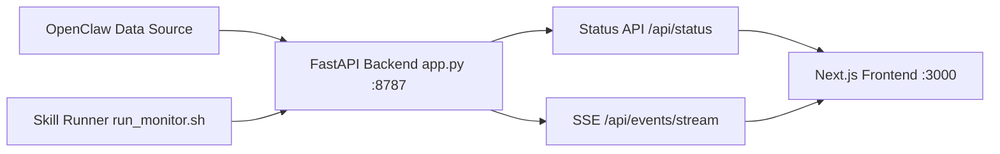

# OpenClaw Agent Control

OpenClaw Agent status monitoring and control console for operations teams.


## Quick Navigation
- Start Here: [3-Minute Quick Start](#3-minute-quick-start)
- Chinese Docs: [README.zh-CN.md](./README.zh-CN.md)
- English Docs: [README.en.md](./README.en.md)
- About: [docs/ABOUT.md](./docs/ABOUT.md)
- Skill Deploy: [scripts/deploy_with_skill.sh](./scripts/deploy_with_skill.sh)
- Full Docs Index: [docs/INDEX.md](./docs/INDEX.md)

## Project Definition
OpenClaw Agent Control is an operational console that combines agent observability and control decisions in one workflow.

## Project Advantages
- Operator-first information architecture: core display appears before secondary diagnostics.
- Practical status semantics: `idle`, `executing`, `waiting`, `stalled`, `blocked`.
- Skill-first deployment: one command to deploy backend + frontend.
- Low operational friction: script-based lifecycle management for production.
- Bilingual onboarding: Chinese and English guides for different teams.

## Core Features
- Agent / Sub-agent real-time status visibility.
- Risk-first triage view (stalled, abnormal, active).
- Timeline-based diagnostics for incident analysis.
- Production lifecycle scripts (start/stop/restart/status/logs).
- Skill-oriented deployment entry for one-command startup.

## Capability Map
| Capability | Description | Entry |
|---|---|---|
| Status Monitoring | Real-time status for Agent / Sub-agent | `GET /api/status` |
| Risk Triage | Stalled/abnormal/active risk-first dashboard | Frontend `:3000` |
| Timeline Diagnostics | Status transition history | `recent_events` |
| Production Ops | start/stop/restart/status/logs | `agent-monitor-ui/scripts/` |
| Skill Deployment | One-command backend+frontend deploy | `scripts/deploy_with_skill.sh` |

## 3-Minute Quick Start
1. Deploy with skill (recommended):
```bash
cd /root/openclaw-monitor-mvp
bash ./scripts/deploy_with_skill.sh
```
2. Open:
- Console: `http://127.0.0.1:3000`
- API: `http://127.0.0.1:8787/api/status`

## Skill-first Deployment
This project is designed for packaged OpenClaw skill workflows.

Default command:
```bash
cd /root/openclaw-monitor-mvp
bash ./scripts/deploy_with_skill.sh
```

Behavior:
- If skill runner exists (`/root/.openclaw/skills/openclaw-monitor/scripts/run_monitor.sh`), backend starts via skill.
- Frontend is built and restarted with production scripts.

Optional custom skill path:
```bash
OPENCLAW_MONITOR_SKILL_DIR=/root/.openclaw/skills/openclaw-monitor \
  bash ./scripts/deploy_with_skill.sh
```

## Documentation
- Chinese Guide: [README.zh-CN.md](./README.zh-CN.md)
- English Guide: [README.en.md](./README.en.md)
- Chinese Tutorial: [docs/TUTORIAL.zh-CN.md](./docs/TUTORIAL.zh-CN.md)
- English Tutorial: [docs/TUTORIAL.en.md](./docs/TUTORIAL.en.md)
- API Reference: [docs/API.md](./docs/API.md)
- Open Source Landscape: [docs/OPEN_SOURCE_LANDSCAPE.md](./docs/OPEN_SOURCE_LANDSCAPE.md)
- Changelog: [CHANGELOG.md](./CHANGELOG.md)
- Contributing: [CONTRIBUTING.md](./CONTRIBUTING.md)
- License: [LICENSE](./LICENSE)

## Architecture


- Backend: `app.py` (FastAPI, status aggregation, event stream, dashboard API)
- Frontend: `agent-monitor-ui/` (Next.js operational dashboard)
- Operations scripts: `agent-monitor-ui/scripts/`
- Skill deployment entry: `scripts/deploy_with_skill.sh`

## Quick Start (Manual)
1. Start backend:
```bash
cd /root/openclaw-monitor-mvp
uv run --with fastapi --with uvicorn python -m uvicorn app:app --host 0.0.0.0 --port 8787
```
2. Start frontend:
```bash
cd /root/openclaw-monitor-mvp/agent-monitor-ui
npm run prod:build
npm run prod:start
```
3. Open:
- Frontend: `http://127.0.0.1:3000`
- Backend API: `http://127.0.0.1:8787/api/status`
